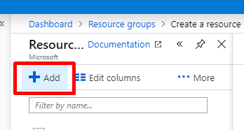

## Step 2: Event Hub Set-Up and Device Simulation

Azure IoT Time Series Insights preview supports both IoT Hub and Event Hubs as event sources. In this lab we'll be setting up an Event Hub and leverage a SPA client to generate and push wind mill sensor data to the hub.

### Create a resource group

1. Create a new Azure resource group (RG) to collect and manage all the application resources we will be provisioning and using during the lab and for ease of resource clean-up post lab. If you prefer, you can also re-use an existing RG.
\

1. Click on **+ Add** button  
\

1. Enter **Resource group name**,  Select **subscription** and **region**. Click on **Review + Create**, and after reviewing, click on **Create**.

### Create an Event Hubs namespace and an Event Hub

TSI preview supports both Azure IoT Hub and Events Hubs as event sources. Up to two event sources are permitted per TSI environment. In this lab we will use an Event Hub as our event source.

1. On the upper left hand corner of the Azure portal click the tool bar and select Create a resource

1. Search the marketplace for "Event Hubs" and click create

1. When you set-up Event Hubs first you create the namespace collection, then you create a hub instance. Fill out the form with the following parameters:

**Parameter**|**Action**
-----|-----
Name|Enter a unique name for the Azure Time Series Insights Preview environment.
Pricing tier|Enter the subscription where you want to create the Azure Time Series Insights Preview environment. A best practice is to use the same subscription as the rest of the IoT resources that are created by the device simulator.
Subscription|Select an existing resource group or create a new resource group for the Azure Time Series Insights Preview environment resource. A resource group is a container for Azure resources. A best practice is to use the same resource group as the other IoT resources that are created by the device simulator.
Resource group|Select a datacenter region for your Azure Time Series Insights Preview environment. To avoid additional latency, it's best to create your Azure Time Series Insights Preview environment in the same region as your IoT Hub created by the device simulator.
Location|Select PAYG (pay-as-you-go). This is the SKU for the Azure Time Series Insights Preview product.
Property ID|Enter a value that uniquely identifies your time series instance. The value you enter in the Property ID box is immutable. You can't change it later. For this tutorial, enter iothub-connection-device-id. To learn more about Time Series ID, see Best practices for choosing a Time Series ID.
Throughput Units|Enter a globally unique name for a new storage account.
Enable Auto-Inflate|Check the checkbox to enable.
Auto-Inflate Maximum Throughput Units|Slide to 12 units.

https://tsiclientsample.azurewebsites.net/windFarmGen.html