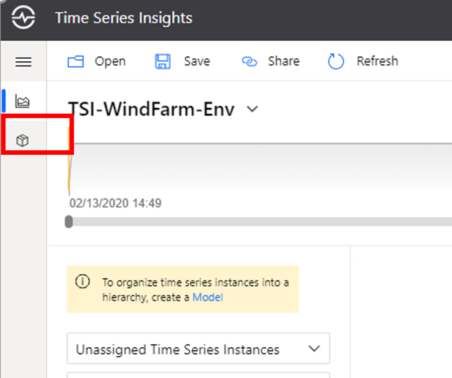
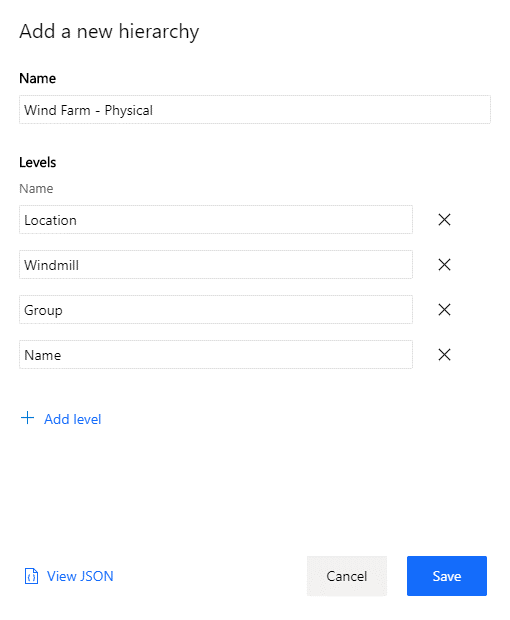
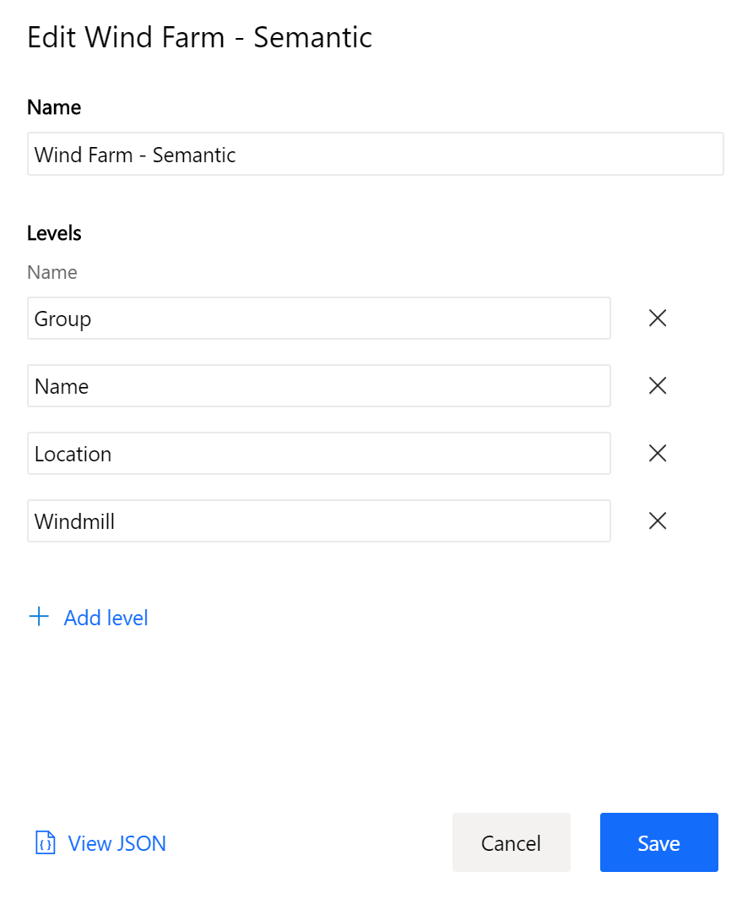
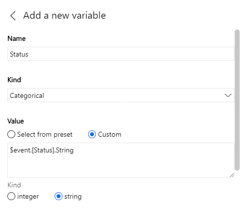
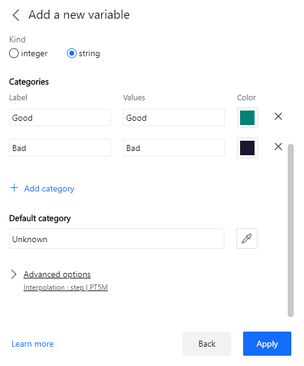
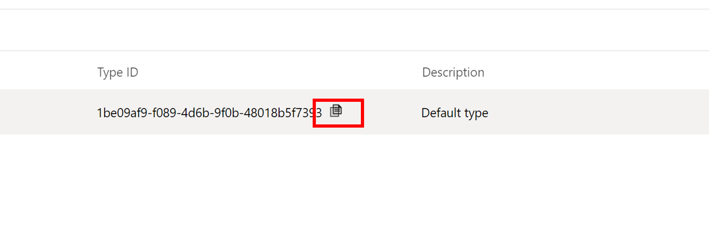

## Step 5: Create a Time Series Model

In this section, you will add time series model entities to contextualize your IoT data. Time Series Model (preview) has 3 components: Types, Hierarchies and Instances.

* Types allow users to define calculations, aggregates, and categories over raw telemetry data, as well as define a tag for the sensor (example: Temperature sensor, Pressure sensor). This is achieved by authoring type variables.
* Hierarchies allow users to specify the structure of their assets. For example, an organization has buildings and buildings have rooms which contain IoT devices. We will leverage the ability to create multiple hierarchical views to see the Contoso Wind Farm data organized in both a physical and sematic structure.
* Instances enrich incoming IoT data with device metadata. An instance links to 1 type definition and multiple hierarchy definitions.

1. In the upper left part of the explorer select the Model tab:

2. In the Hierarchies section, select “+ Add”.

A modal will open. Add the following values:

Name: Wind Farm - Physical
Levels:
Name the first level “Location”.
Click “+ Add Level” and add another sub-level named "Windill".
Add two more levels: "Group" and "Name".

3. If you don't see the hierarchy listed refresh the page. 

4. Repeate the steps above to add antoher hierarchy named "Wind Farm - Semantic" with the following levels: 

Group > Name > Location > Windmill

5. Now that there are two hierarchies navigate to the Types section. For the lab we will be adding variables to the default type. Click the pencil icon to open the editor, and select the Variables tab. Click "+ Add variable" and enter the following fields:

Name: "Value"
Kind: "Numeric"
Value: Select from preset
In the drop-down menu select "Value (Double)"

We will not be using the advanced variable options, however, you can expand the section to view the options offered, including modifying the aggregation and configuring interpolation or a value filter.

Click "Apply"

Next we will add a categorical variable. Categorical variables allow you to set a descriptive label or category to a discrete value. For example, 0 or 1 might be sent in an event payload, but an operations manager may instead prefer to see "On" and "Off" in the explorer. Note that there is an error in the lab for this varaible example--0 and 1 were intended to be in the event payload, but you'll see in the example below that the actual text is sent instead. Given time constraints, please "squint your eyes" to see these numeric values categorized, and this will be fixed for future labs.

Click "Add" and enter the following fields:

Name: "Status"
Kind: "Categorical"
Value: Custom
In the input box enter "$event.[Status].String"
Kind: String

Categories:
Label: Good
Values: Good
Color: Select a color

Label: Bad
Values: Bad
Color: Select a color

Default category: Unknown

Click Apply and then click Save.

We will be using the bulk-upload feature to create a time series instance for each of the 111 sensors, assign the default type, and add then to both of the hierarchies. This segment will include some copy and pasting. Open the Instances.json file that was downloaded by the data simulator. If you're using VS Code, you can easily format the JSON: Shft + Alt + F or ctrl + P and type ">Format" then select "Format Document."

Navigate back to the explorer and copy the Type ID of the Default Type:

In the Instances.json file, find and replace all instances of "tTBD" with the GUID, being sure that the ID is enclosed in just one pair of ""

Next we will copy the two GUIDs of both hierarchies and use another text editor to get them into following format before doing the replace all: "<GUID>", "<GUID>"

In the explorer click on the Hierarchies tab and copy both hierarchy IDs and use any editor to insert the comma between the GUIDs. Copy that entire value and replace all instances of "hTBD":

Save your updated file and in the explore go to the Instances tab and select Upload JSON:

Choose your Instances.JSON file and click upload:

Your data is now modeled in both a physical and semantic hierarchy, navigate back to the analyze tab and expand each hierarchy to view the topology:

